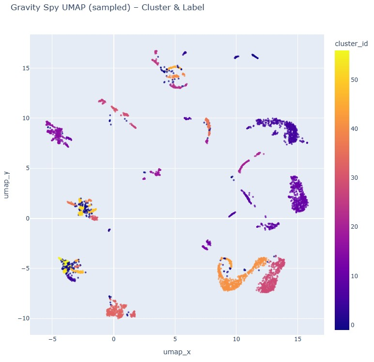

# Gravity Spy Glitch Explorer  
*A visual and interactive exploration of LIGO glitch morphology using CNN embeddings, UMAP, and HDBSCAN.*



---

## 🚀 Overview

This project builds an **interactive, physics-informed explorer** for the Gravity Spy glitch dataset, used by LIGO/Virgo/KAGRA to classify non-astrophysical noise (“glitches”) in gravitational-wave detectors.

Using a pretrained **ResNet-18** to extract embeddings from 34,332 spectrograms, followed by **UMAP** for dimensionality reduction and **HDBSCAN** for clustering, this tool allows users to:

- Explore LIGO glitch morphology in 2D  
- Hover over each point to view the **actual spectrogram**  
- Visually inspect substructure inside large glitch classes  
- Identify human vs. machine discrepancies  
- Build a foundation for Phase B (aux channel correlation) and Phase C (impact analysis)

This repository currently contains **Phase A** of the planned research pipeline.

---

## 🔍 Live Interactive Dashboard

Click below to explore the 2D embedding:

👉 **[Interactive UMAP Dashboard](https://davismwhaley.github.io/gravityspy-glitch-explorer/figures/umap_interactive_sample.html)**

- Pan & zoom freely  
- Hover over points to see spectrogram thumbnails  
- Color-coded by HDBSCAN cluster  
- Subsampling used for performance (< 5K points shown live)

---

## 🧠 Methods Summary

### **1. CNN Embeddings (ResNet-18)**
- Spectrograms resized to 224×224  
- Converted to 3-channel grayscale  
- Passed through ImageNet-pretrained ResNet-18  
- Final FC layer replaced with `Identity()`  
- Output: **512-dim embedding per image**  
- Total embeddings: **34,332**

### **2. Dimensionality Reduction (UMAP)**
- UMAP (`n_neighbors=30`, `min_dist=0.1`)  
- Produces smooth, interpretable 2D manifold  
- Captures similarity of glitch morphology

### **3. Clustering (HDBSCAN)**
- Automatically identifies dense “islands”  
- Noise (cluster = -1) retained for future analysis  
- Many clusters show **high purity** relative to Gravity Spy labels

### **4. Interactive Visualization (Plotly)**
- Points are clickable/hoverable  
- Thumbnails encoded in base64  
- Cluster & label data embedded in hover tooltips  
- Exported to standalone HTML for GitHub Pages

---

## 🌌 Scientific Context

LIGO detectors are extraordinarily sensitive — enough to detect distortions in spacetime smaller than a proton.  
However, they are also sensitive to numerous instrumental or environmental “glitches.”  

This project uses deep learning + dimensional reduction to examine:

- How glitch types cluster morphologically  
- Whether new substructure exists within dominant categories  
- Where human labels and machine clusters disagree  
- What patterns may be candidates for follow-up during Phase B

---

## 📅 Roadmap

### **Phase A — Embedding & Visualization (✔ Complete)**  
- CNN embeddings  
- UMAP projection  
- HDBSCAN clustering  
- Interactive explorer  
- Cluster atlas

### **Phase B — Detector Coupling (Next)**  
- Use GWpy to load auxiliary channels  
- Correlate glitch families with instrument states  
- Example: Scattered light vs. ground motion

### **Phase C — Impact & Explainability**  
- Train interpretable models (Random Forest / XGBoost)  
- Use SHAP values to identify channels driving glitch production  
- Produce “Glitch Cost Ranking” dashboard

---
MIT License — feel free to fork, modify, and build upon this project.
---

**Acknowledgments**
Gravity Spy (GWOSC + Zooniverse)

LIGO/Virgo/KAGRA Collaboration

PyTorch, UMAP-learn, HDBSCAN, Plotly
---

## 🛠 Installation (local)

Requires Python 3.10+.

```bash
pip install -r notebooks/requirements.txt

